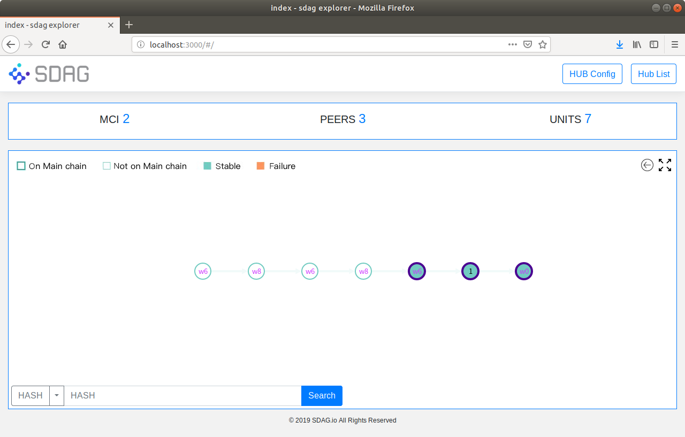
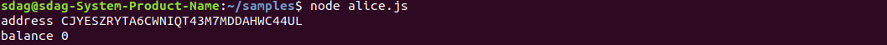
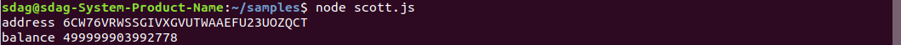

### 1 install docker-ce

ubuntu:

https://docs.docker.com/install/linux/docker-ce/ubuntu/ 

centos:

https://docs.docker.com/install/linux/docker-ce/centos/

fedora:
https://docs.docker.com/install/linux/docker-ce/fedora/

Mac:

https://docs.docker.com/docker-for-mac/install/ 

windows:

https://docs.docker.com/docker-for-windows/install/


### 2 add user to docker group

```
sudo gpasswd -a $(whoami) docker
```

### 3 get sdag testnet for developer

```
docker pull registry.cn-beijing.aliyuncs.com/sdag/sdag_testnet_dev:latest
```

### 4 start sdag testnet

```
docker run --rm -d --name sdag -p 6615:6615 -p 8080:8080 registry.cn-beijing.aliyuncs.com/sdag/sdag_testnet_dev
```

### 5 visit explorer

```
http://localhost:8080
```



### 6 get mnemonic

> this mnemonic has many many token 

```
sudo docker exec -it sdag cat data/sdg/settings.json
```

return like this:


copy mnemonic, for step 7 use.

```
fade aunt crack express uncle fit valley faculty candy toddler buzz pink
```

### 7 send token

not in docker,in your local Terminal, make a dir named samples and install sdagwallet.js

```
mkdir samples
cd samples
npm init
npm isntall sdagwallet.js
```

make a file named mnemonic.js

```
const { default: Wallet } = require("sdagwallet.js");
let wallet = new Wallet();
var mnemonic = wallet.generateMnemonic();
console.log(mnemonic);
```

run it
```
node mnemonic.js
```

return like this:


copy mnemonic and make a file named alice.js

```
const { default: Wallet } = require("sdagwallet.js");
//import Wallet from 'sdagwallet.js';
let wallet = new Wallet();

const mnemonic = "april warrior alarm actress end story social palm desert twist knife future";

wallet.configHub("ws://localhost:6615");
wallet.loginWithMnemonic(mnemonic).then(() => {
    var address = wallet.getAddress();
    console.log("address",address);
    wallet.getBalance().then((balance) => {
        console.log("balance",balance);
    });
});

```

run it 
```
node alice.js
```

return like tihs, balance is zero.



copy address for alice

```
HKIRYKXL65TTTBLIW3CXIYQHGPBX3YGI
```

make a file named scott.js and replace mnemonic to "fade aunt crack express uncle fit valley faculty candy toddler buzz pink" (from step 6) 

```
const { default: Wallet } = require("sdagwallet.js");
//import Wallet from 'sdagwallet.js';
let wallet = new Wallet();

const mnemonic = "fade aunt crack express uncle fit valley faculty candy toddler buzz pink";

wallet.configHub("ws://localhost:6615");
wallet.loginWithMnemonic(mnemonic).then(() => {
    var address = wallet.getAddress();
    console.log("address",address);
    wallet.getBalance().then((balance) => {
        console.log("balance",balance);
    });
});

```

run it 

```
node scott.js
```

return like this




now , make a file named scott-to-alice.js

```
const { default: Wallet } = require("sdagwallet.js");
//import Wallet from 'sdagwallet.js';
let wallet = new Wallet();
const mnemonic = "fade aunt crack express uncle fit valley faculty candy toddler buzz pink";
wallet.configHub("ws://localhost:6615");
wallet.loginWithMnemonic(mnemonic).then(async () => {
    await wallet.getBalance();
    wallet.send({
        to: 'HKIRYKXL65TTTBLIW3CXIYQHGPBX3YGI',
        amount: 10,
        text: 'from scott to alice'
    }).then(() => {
        console.log("ok");
    }).catch((err) => {
        console.log(err);
    });
});

```

run it


get balance of alice again

```
node alice.js
```


get balance of scott again


now send token finish

samples at https://github.com/smart-dag/samples.git


