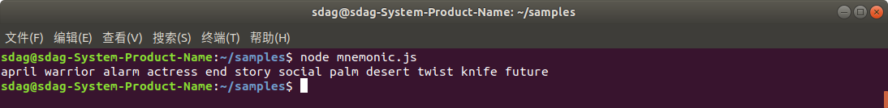
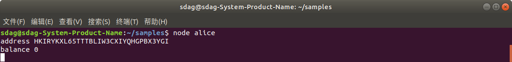
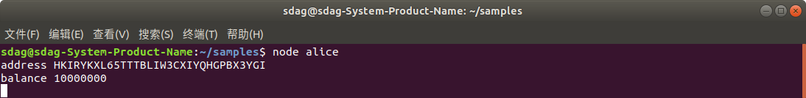
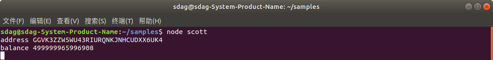

# 本地搭建SDAG区块链并完成转账

> 按照本文档的步骤执行，你可以在本地搭建一个SDAG区块链，并使用SDAG的jssdk构建一个命令行钱包来查询和转账。

### 1 安装docker社区版

ubuntu用户请参考如下安装方式:

https://docs.docker.com/install/linux/docker-ce/ubuntu/ 

centos用户请参考如下安装方式:

https://docs.docker.com/install/linux/docker-ce/centos/

fedora用户请参考如下安装方式:
https://docs.docker.com/install/linux/docker-ce/fedora/

Mac用户请参考如下安装方式:

https://docs.docker.com/docker-for-mac/install/ 

windows用户请参考如下安装方式:

https://docs.docker.com/docker-for-windows/install/


### 2 把当前用户添加到docker用户组

```
sudo gpasswd -a $(whoami) docker
```

### 3 获得SDAG区块链镜像

```
docker pull registry.cn-beijing.aliyuncs.com/sdag/sdag_testnet_dev:latest
```

### 4 启动SDAG区块链

```
docker run --rm -d --name sdag -p 6615:6615 -p 8080:8080 registry.cn-beijing.aliyuncs.com/sdag/sdag_testnet_dev
```

### 5 打开区块链浏览器

```
http://localhost:8080
```


### 6 获得创始后有数字资产的助记词

```
sudo docker exec -it sdag cat data/sdg/settings.json
```

返回的结果类似:


拷贝下助记词，供第7步使用.

```
fade aunt crack express uncle fit valley faculty candy toddler buzz pink
```

### 7 发送数字资产

在本地计算机（非docker里），新建一个名为samples的文件夹。

```
mkdir samples
cd samples
```

初始化npm，并安装SDAG的jssdk：sdagwallet.js

```
npm init
npm isntall sdagwallet.js
```

新建一个名为mnemonic.js的文件，输入以下内容：

> 该文件使用mnemonic.js生成随机助记词
```
const { default: Wallet } = require("sdagwallet.js");
let wallet = new Wallet();
var mnemonic = wallet.generateMnemonic();
console.log(mnemonic);
```

执行它：

```
node mnemonic.js
```

得到类似下图的结果:




拷贝助记词，并建立一个名为 alice.js 的文件，在 mnemonic = "" 中填入助记词，内容如下：

```
const { default: Wallet } = require("sdagwallet.js");
//import Wallet from 'sdagwallet.js';
let wallet = new Wallet();

const mnemonic = "april warrior alarm actress end story social palm desert twist knife future";

wallet.configHub("ws://localhost:6615");
wallet.loginWithMnemonic(mnemonic).then(() => {
    var address = wallet.getAddress();
    console.log("address",address);
    wallet.getBalance().then((balance) => {
        console.log("balance",balance);
    });
});

```

执行它：
```
node alice.js
```

返回的结果如下，能看到alice的地址，及余额。



拷贝alice的地址，留作scott给alice转账时使用。

```
HKIRYKXL65TTTBLIW3CXIYQHGPBX3YGI
```

新建一个名为 scott.js 的文件，并且把助记词配置为 "fade aunt crack express uncle fit valley faculty candy toddler buzz pink" (在第6步时从docker里得到的) 

```
const { default: Wallet } = require("sdagwallet.js");
//import Wallet from 'sdagwallet.js';
let wallet = new Wallet();

const mnemonic = "fade aunt crack express uncle fit valley faculty candy toddler buzz pink";

wallet.configHub("ws://localhost:6615");
wallet.loginWithMnemonic(mnemonic).then(() => {
    var address = wallet.getAddress();
    console.log("address",address);
    wallet.getBalance().then((balance) => {
        console.log("balance",balance);
    });
});

```

执行它

```
node scott.js
```

返回的结果如下：


现在，新建一个名为 scott-to-alice.js 的文件，内容如下：

```
const { default: Wallet } = require("sdagwallet.js");
//import Wallet from 'sdagwallet.js';
let wallet = new Wallet();
const mnemonic = "fade aunt crack express uncle fit valley faculty candy toddler buzz pink";
wallet.configHub("ws://localhost:6615");
wallet.loginWithMnemonic(mnemonic).then(async () => {
    await wallet.getBalance();
    wallet.send({
        to: 'HKIRYKXL65TTTBLIW3CXIYQHGPBX3YGI',
        amount: 10,
        text: 'from scott to alice'
    }).then(() => {
        console.log("ok");
    }).catch((err) => {
        console.log(err);
    });
});

```

执行它

```
node scott-to-alice
```

返回的结果如下：


这说明已经完成转账，接下来，重新获得 alice 的余额：

```
node alice
```
返回结果如下：



重新获得 scott 的余额：

```
node scott
```

返回结果如下：




转账结束了，上述源码位于： https://github.com/smart-dag/samples.git


