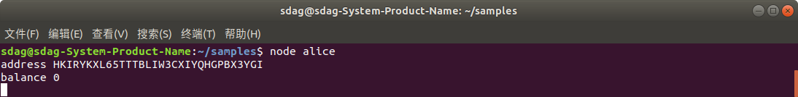
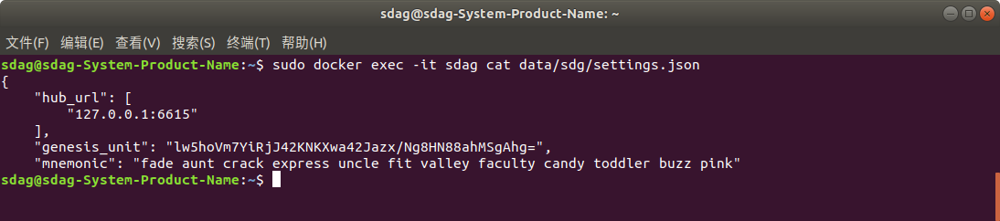
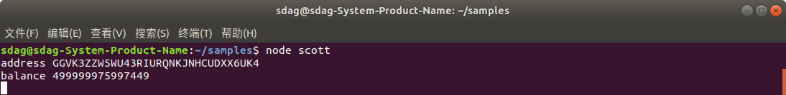
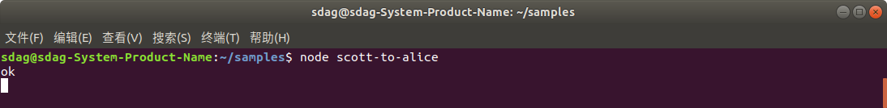

# 从 scott 给 alice 转账

### 前提

你需要确保本地已经在 docker 中启动了 SDAG 区块链。

启动方法，参考：https://github.com/smart-dag/docs/blob/master/start-docker/README.md

### 克隆并安装示例

```
git clone https://github.com/smart-dag/samples.git
cd samples
npm install
```

### 生成一个助记词汇给alice

```
node mnemonic
```

![mnemonic.png]

更改 scott-to-alice/alice.js，配置好生成的助记词：

```
const { default: Wallet } = require("sdagwallet.js");
//import Wallet from 'sdagwallet.js';
let wallet = new Wallet();

const mnemonic = "april warrior alarm actress end story social palm desert twist knife future";

wallet.configHub("ws://localhost:6615");
wallet.loginWithMnemonic(mnemonic).then(() => {
    var address = wallet.getAddress();
    console.log("address",address);
    wallet.getBalance().then((balance) => {
        console.log("balance",balance);
    });
});

```

运行后，alice的数字资产为0：

```
node alice
```



要复制下alice的地址，后面会用到。

### 使用基金会的助记词给 scott

基金会的助记词为 "fade aunt crack express uncle fit valley faculty candy toddler buzz pink" 该助记词可以从docker中获得。

```
sudo docker exec -it sdag cat data/sdg/settings.json
```



打开 scott.js ，把基金会的助记词替换进去，然后执行：
```
node scott
```

可以看到，scott拥有好多数字资产。



### 从 scott 给 alice 转数字资产

打开文件 scott-to-alice.js ，配置好基金会的助记词和alice的地址：

```
const { default: Wallet } = require("sdagwallet.js");
//import Wallet from 'sdagwallet.js';
let wallet = new Wallet();
const mnemonic = "fade aunt crack express uncle fit valley faculty candy toddler buzz pink";
wallet.configHub("ws://localhost:6615");
wallet.loginWithMnemonic(mnemonic).then(async () => {
    await wallet.getBalance();
    wallet.send({
        to: 'HKIRYKXL65TTTBLIW3CXIYQHGPBX3YGI',
        amount: 10,
        text: 'from scott to alice'
    }).then(() => {
        console.log("ok");
    }).catch((err) => {
        console.log(err);
    });
});
```

运行 scott-to-alice.js

```
node scott-to-alice
```




这个时候，scott已经把数字资产转给alice了。

再看一下alice的余额：

```
node alice
```


再看一下scott的余额：

```
node scott
```


